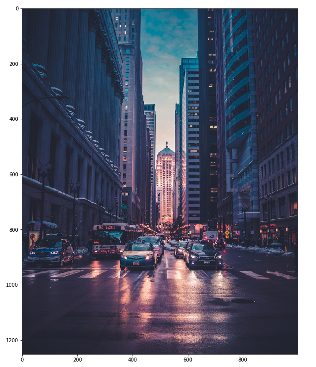
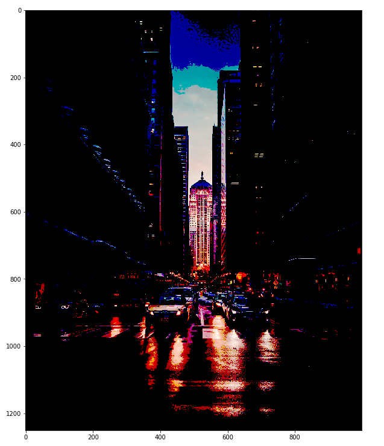
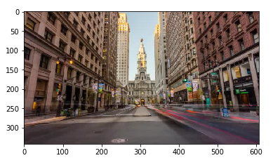
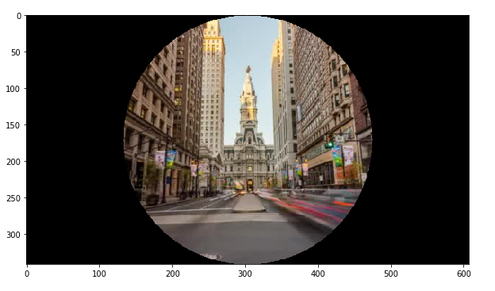
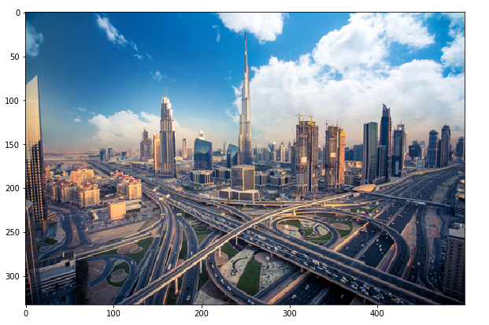
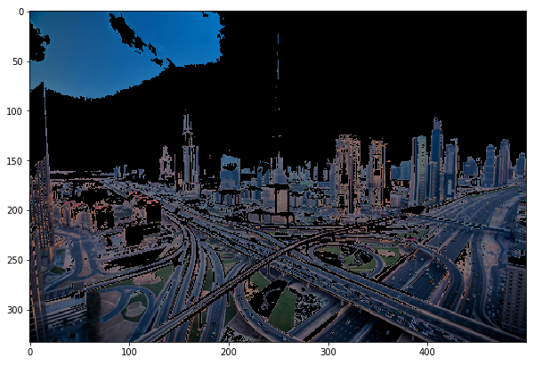

# DataScience - Image Manipulation

Image manipulation project with Python.

## Description

Using DataScience techniques, images are manipulated and filters are created.

## Used Tools

- Python
- Jupyter notebook
- Numpy
- Matplotlib
- Scipy

## Captures

